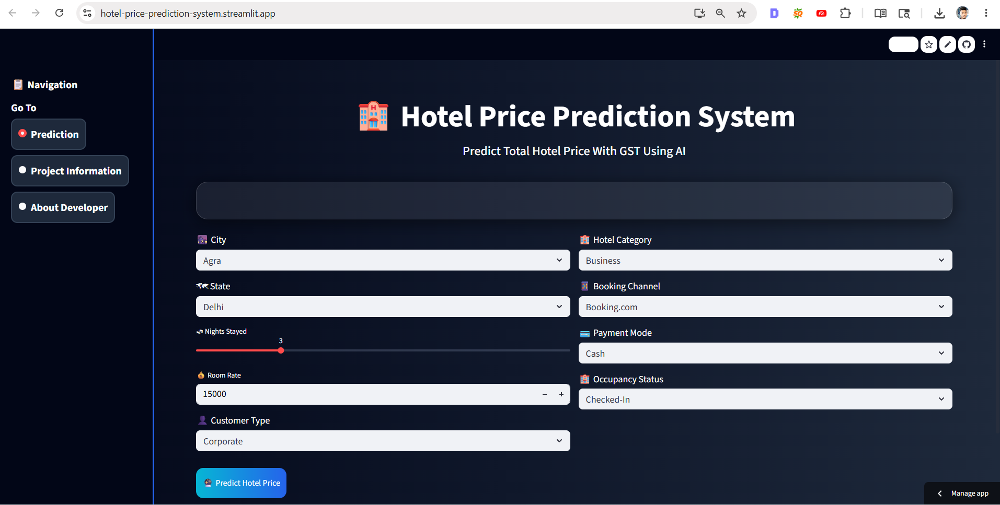

# 🏨 Hotel Price Prediction System

A Machine Learning-based Hotel Price Prediction System developed using **Python, Scikit-learn, Pandas, and Streamlit**.  
This application predicts the **total hotel booking price including GST** based on hotel category, city, booking channel, customer type, occupancy status, room rate, and nights stayed.

---

# 🚀 Live Demo

👉 [Click Here To Open Live App](https://hotel-price-prediction-system.streamlit.app/)

---

# 📌 Problem Statement

Hotel pricing changes dynamically based on multiple factors such as:

- Hotel Category
- Room Rate
- Occupancy Status
- Customer Type
- Booking Channel
- Nights Stayed
- City and State

Manually estimating hotel booking prices with GST can be difficult and inconsistent.  
This project solves that problem using **Machine Learning regression models** to predict accurate hotel prices automatically.

---

# 🤖 Machine Learning Algorithm Used

This project uses:

## ✅ Random Forest Regressor

The model was trained using:

- Random Forest Regressor
- Hyperparameter Tuning
- RandomizedSearchCV
- Cross Validation
- Feature Engineering
- Data Preprocessing

---

# ⚙️ Hyperparameter Tuning & Cross Validation

To improve model performance and stability:

- RandomizedSearchCV was used for hyperparameter tuning
- Cross Validation was applied for better generalization
- Multiple hyperparameter combinations were tested
- Best optimized Random Forest model was selected

### Hyperparameters Tuned

- `n_estimators`
- `max_depth`
- `min_samples_split`
- `min_samples_leaf`
- `max_features`

---

# 📊 Model Performance

## ✅ Train Score

```python
Train Score : 0.9827791421865248
```

## ✅ Test Score

```python
Test Score : 0.9585261024956915
```

The model achieved strong prediction accuracy with good generalization performance.

---

# 🖼️ Application Preview



---

# 🧠 Features

- Predicts Hotel Price Including GST
- Interactive Streamlit UI
- Dynamic User Inputs
- Real-Time Prediction
- Machine Learning-Based Prediction System
- Clean and Responsive Interface

---

# 🛠️ Technologies Used

- Python
- Pandas
- NumPy
- Scikit-learn
- Streamlit
- Joblib
- Matplotlib

---

# 📂 Project Structure

```bash
hotel-price-prediction-system-streamlit-app/
│
├── app.py
├── requirements.txt
├── README.md
├── hotel_price.ipynb
├── models/
│   ├── hotel_price_model.pkl
│   └── model_columns.pkl
│
├── Images/
│   └── sumit.jpg
│
└── app_view.png
```

---

# ▶️ Run Locally

## Clone Repository

```bash
git clone https://github.com/Sumitghodke16/hotel-price-prediction-system-streamlit-app.git
```

## Install Requirements

```bash
pip install -r requirements.txt
```

## Run Streamlit App

```bash
streamlit run app.py
```

---

# 🌐 Deployment

This application is deployed using **Streamlit Community Cloud**.

🔗 Live Application:

👉 [Open Hotel Price Prediction System](https://hotel-price-prediction-system.streamlit.app/)

---

# 👨‍💻 Author

## Sumit Ghodke

🔗 [LinkedIn Profile](https://www.linkedin.com/in/sumit-ghodke-a45a82205/)
